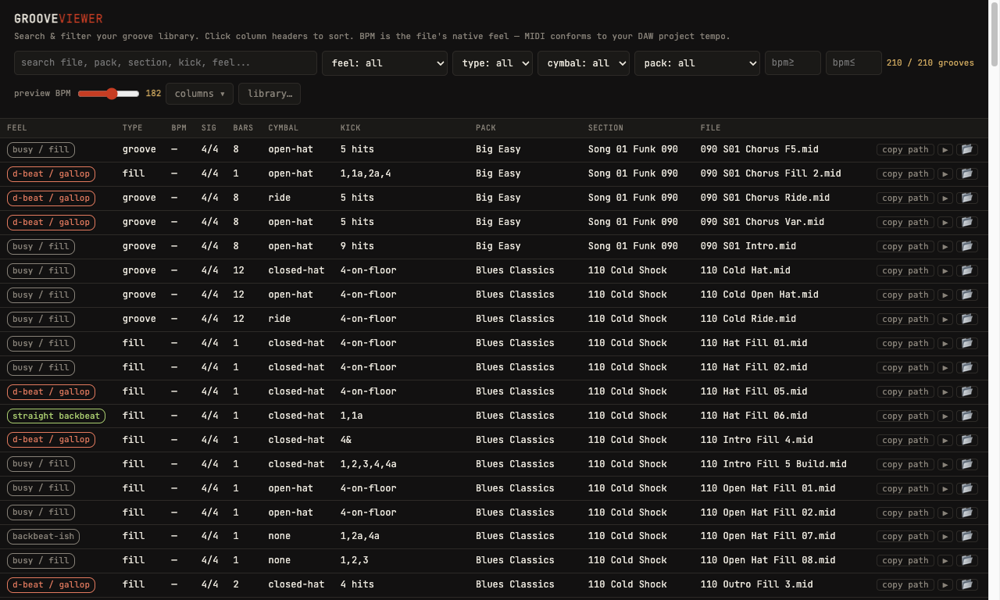

# GrooveViewer

Scan, catalog, and preview your own drum-groove MIDI libraries (SSD5,
EZdrummer/Superior, Groove Monkee, raw MIDI folders). Cross-platform
Electron desktop app. Product #3 of Bloody Finger Music.


*Your own scanned library — GrooveViewer never ships or bundles catalog data from commercial packs.*

**The one non-negotiable: Scan, don't ship.** The app scans the user's own
installed libraries. No groove MIDI or catalog data derived from commercial
libraries is ever bundled, embedded, or committed.

## Run

```
npm install
npm start
```

On first launch, point GrooveViewer at your groove library folder (e.g. your
SSD5 `Grooves` directory, an EZdrummer MIDI folder, or any folder of `.mid`
files). It scans the folder and classifies each groove — tempo, time
signature, length, feel, kick pattern, cymbal type, hit count, and toms —
straight from the MIDI, and caches the catalog in the OS app-data dir. Use
the **library…** button to switch folders or rescan — rescans are
incremental, so unchanged files (same size + modified time) are reused
instead of re-parsed. Your search/filter state and window size are
remembered across launches.

Drag any **file name** in the table straight into your DAW to import the
groove.

## Test

```
npm test
```

Runs the scanner self-check: a synthetic in-memory MIDI fixture and a pure
`classify()` fixture (always), plus — when the dev ground-truth data and
library volume are present — a 397-file sample compared against the
prototype catalog. Measured agreement: header facts (bpm/ts/bars) 99.7%,
hit count 100%, toms 87.7%, cymbal type 91.2%, feel 71.5%. The classifier
floors are lower than the header-fact floors on purpose — see
[Classifier accuracy](#classifier-accuracy) below.

## Dev ground truth (local only, gitignored)

`dev-data/catalog.json.gz` is the 396k-record catalog extracted from the
personal-use prototype (`beat-catalog.html`, also gitignored). The app never
reads it — it's the validation corpus for the scanner/classifier. To
regenerate it:

```
python3 -c "
import re, base64
src = open('beat-catalog.html', encoding='utf-8').read()
m = re.search(r\"const B64='\", src)
blob = src[m.end():src.index(chr(39), m.end())]
import pathlib; pathlib.Path('dev-data').mkdir(exist_ok=True)
open('dev-data/catalog.json.gz','wb').write(base64.b64decode(blob))
"
```

## Preview sounds

Groove preview plays the **actual MIDI notes** from each file through a
curated set of 21 acoustic drum one-shots from **DRSKit 2** by the
[DrumGizmo project](https://drumgizmo.org/kits/), used under
[CC BY 4.0](https://creativecommons.org/licenses/by/4.0/) — see
[assets/drskit/ATTRIBUTION.md](assets/drskit/ATTRIBUTION.md). The preview
BPM slider sets the playback tempo regardless of each file's native tempo;
the **vol** slider sets preview loudness (also handy for tuning against
your own DAW mix).

Audition from the keyboard: **↑/↓** move through the list (playback follows
while a groove is playing), **space/enter** plays or stops the selected
groove, **esc** stops.

## Classifier accuracy

The feel/kick/cymbal/toms classifier in `scanner.js` was reverse-engineered
against the prototype's 396k-record catalog the same way the header-fact
parser was, but hit a real ceiling: MIDI note-number-to-drum-piece mapping
isn't fully standardized across sample libraries (SSD5, EZX, and Groove
Monkee kits each assign kick/snare/tom/cymbal to slightly different note
numbers), so a single note-map can't classify every library with header-fact
precision. The numbers above are the measured ceiling, not a bug to chase
to 100% — `npm test` asserts floors at those levels so a real regression
still fails loudly.

## Building the app

```
npm run package   # dist/mac-arm64/GrooveViewer.app — unsigned dev build
npm run dist       # DMG, when we want one
```

`package.json`'s `build.files` is a **whitelist** — only the files it names
ever enter the bundle, so `dev-data/` and `beat-catalog.html` can't leak in
even by accident. Developer ID signing, notarization, and an app icon are
still open for a real release build.

## Roadmap (see `.claude/STATUS.md` for live state)

1. ✅ Electron shell + catalog browser (port of the prototype UI)
2. ✅ Library picker + scanner (header facts: BPM, time signature, bars)
3. ✅ Real MIDI playback for previews (DRSKit samples; replaced the
   prototype's synth caricature)
4. ✅ Feel classifier (feel, kick pattern, cymbal, hit count, toms —
   see [Classifier accuracy](#classifier-accuracy))
5. ✅ Drag-to-DAW — drag a file name out of the table into your DAW
6. ✅ Packaged as a macOS desktop app (`npm run package`)
